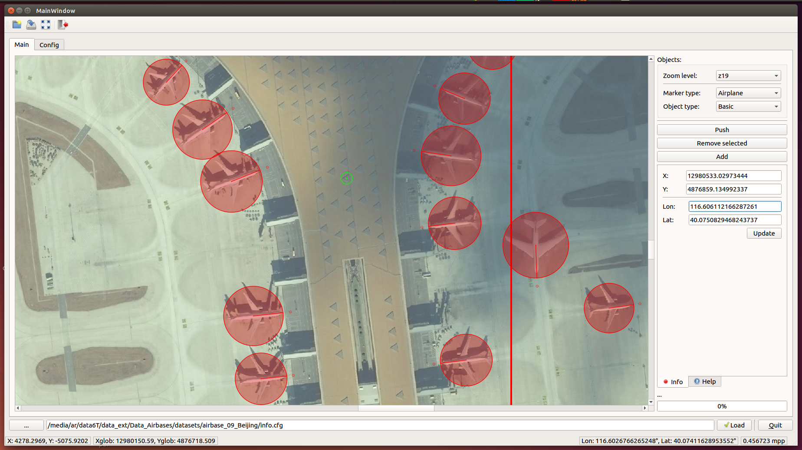
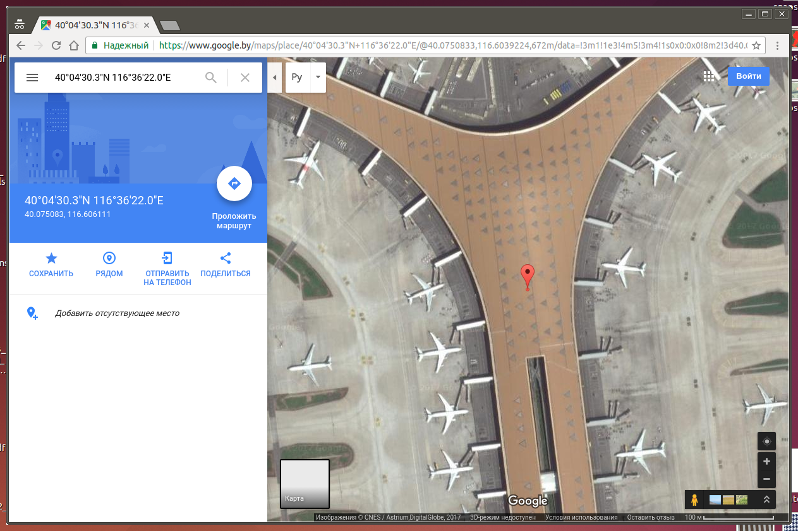
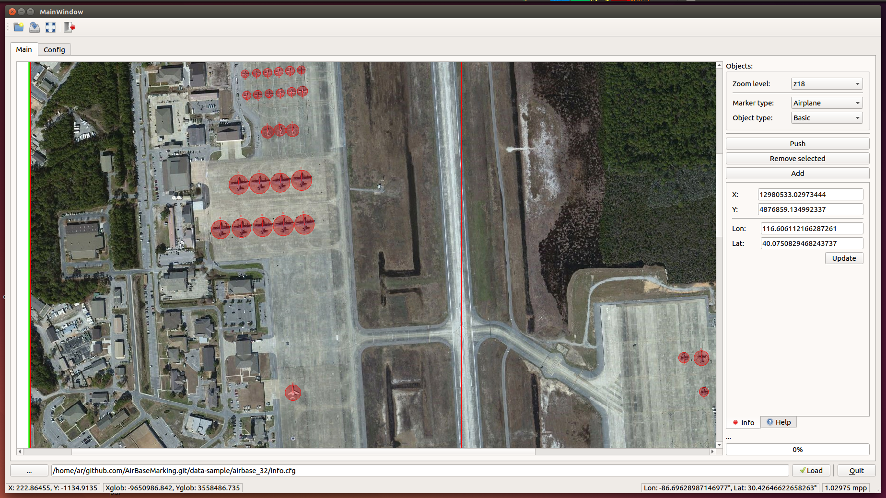

# AirBaseMarking
Simple application (with Qt UI interface) for airplane marking program with geo-referenced coordinates.

Dependency:
- [Qt5](https://www.qt.io/)
- [GeographicLib](https://geographiclib.sourceforge.io/)
- [Proj4](http://proj4.org/)

------------------------------

Install dependencies (Ubuntu):
```
sudo apt-get install libgeographiclib-dev libproj-dev
```

------------------------------

Build and run:
```
mkdir build
cd build
qmake ../src
make -j6
./ProjectAirBaseMarking
```

------------------------------




